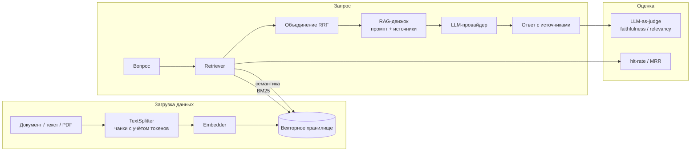

# RAGForge

**RAG-сервис, не зависящий от конкретных провайдеров**: подключаемые языковые
модели, эмбеддинги и векторные хранилища, гибридный поиск по смыслу и ключевым
словам, потоковые ответы и встроенная оценка качества. Сервис построен на
FastAPI.


> **Полностью работает без интернета и API-ключей.** По умолчанию используются
> детерминированные хеш-эмбеддинги, локальное векторное хранилище в памяти и
> тестовая LLM. Можно клонировать проект, установить зависимости и запустить
> весь конвейер, а затем одной переменной подключить OpenAI, Anthropic или
> Chroma.

## Зачем нужен проект

Большинство демонстраций RAG — это один скрипт с жёстко заданными моделью
эмбеддингов, векторной базой и LLM. RAGForge устроен ближе к боевому сервису:

- **Чёткие абстракции.** `Embedder`, `VectorStore` и `LLMProvider` — интерфейсы.
  Конкретные реализации выбираются во время запуска, поэтому для замены
  провайдера не нужно менять код.
- **Гибридный поиск.** Семантический поиск по векторам объединяется с индексом
  BM25 для точного поиска по словам с помощью Reciprocal Rank Fusion.
- **Оценка качества — часть системы.** В комплекте есть метрики поиска
  (hit-rate, MRR) и оценка ответа LLM-as-judge (faithfulness,
  answer-relevancy). Систему, которую нельзя измерить, нельзя нормально
  улучшать.
- **Тестируемость и воспроизводимость.** Офлайн-режим позволяет запускать все
  модульные тесты в CI без сети и секретов. Сейчас в проекте 36 тестов.

## Архитектура



У каждого компонента за интерфейсом есть минимум две реализации:

| Компонент | Офлайн-реализация | Подключаемые реализации |
|---|---|---|
| LLM | `mock` (детерминированная) | OpenAI, Anthropic (Claude) |
| Эмбеддинги | `hash` (детерминированные) | OpenAI (`text-embedding-3-*`) |
| Векторное хранилище | `memory` (numpy) | Chroma (сохранение на диске) |
| Поиск | Гибридный (dense + BM25) | Только dense-поиск |

## Быстрый старт без ключей

```bash
pip install -r requirements.txt

# 1. Запустить демонстрацию всего конвейера в терминале
python -m scripts.demo

# 2. Или запустить API
uvicorn app.main:app --reload
# открыть http://localhost:8000/docs
```

Добавить текст можно так:

```bash
curl -s localhost:8000/ingest/text -H 'content-type: application/json' -d '{
  "text": "RAG добавляет к ответу LLM найденный контекст.",
  "collection": "kb", "source": "заметки.md"
}'
```

Задать вопрос:

```bash
curl -s localhost:8000/query -H 'content-type: application/json' -d '{
  "question": "Зачем нужен RAG?", "collection": "kb"
}'
```

Выполнить обычный семантический и ключевой поиск:

```bash
curl -s localhost:8000/search -H 'content-type: application/json' -d '{
  "query": "ответы с источниками", "collection": "kb"
}'
```

### Данные для проверки UI

Чтобы заполнить локальное хранилище готовыми русскоязычными записями, выполни
из корня проекта:

```bash
python -m scripts.seed_ui_data
```

Скрипт создаёт коллекцию `ui-demo` и сохраняет в неё четыре документа. При
повторном запуске пересоздаётся только эта коллекция; остальные коллекции не
затрагиваются. После запуска API перезапусти, если он уже был запущен, чтобы он
загрузил обновлённое хранилище.

## Подключение реальных провайдеров

Скопируй `.env.example` в `.env` и задай нужные переменные. Код менять не нужно:

```bash
# Claude для генерации, OpenAI для эмбеддингов, Chroma для хранения
RAGFORGE_LLM_PROVIDER=anthropic
RAGFORGE_ANTHROPIC_API_KEY=sk-ant-...
RAGFORGE_EMBEDDING_PROVIDER=openai
RAGFORGE_OPENAI_API_KEY=sk-...
RAGFORGE_VECTORSTORE=chroma
```

Установи нужные дополнительные зависимости:

```bash
pip install -e ".[openai,anthropic,chroma,pdf]"
```

## API

| Метод и путь | Описание |
|---|---|
| `GET /health` | Состояние сервиса и активные провайдеры |
| `POST /ingest/text` | Разбить текст на чанки, построить эмбеддинги и проиндексировать |
| `POST /ingest/file` | Добавить загруженный `.txt`, `.md` или `.pdf` |
| `POST /search` | Гибридный поиск с оценками совпадения |
| `POST /query` | Полный RAG-ответ с источниками |
| `POST /query/stream` | То же самое через Server-Sent Events |
| `GET /collections` | Список коллекций и количество чанков |
| `DELETE /collections/{n}` | Удалить коллекцию |
| `GET /documents` | Документы коллекции (сгруппированы по источнику) |
| `DELETE /documents?source=…` | Удалить все чанки документа |
| `DELETE /chunks/{id}` | Удалить один чанк по идентификатору |
| `POST /eval/judge` | Оценить ответ с помощью LLM-as-judge |
| `GET /graph` | Граф семантического сходства чанков коллекции |

Интерактивная документация Swagger доступна по адресу `/docs`.

## Веб-интерфейс на Vue 3

В каталоге [frontend/](frontend) находится панель на Vue 3 и TypeScript. В ней
можно добавлять и удалять документы, задавать вопросы и исследовать
интерактивный **семантический граф** чанков: вершины — чанки, связи —
косинусное сходство, размер вершины зависит от её степени, а цвет показывает
исходный документ. Источники ответа подсвечиваются на графе.

Интерфейс покрывает все возможности API:

- **Добавление данных** — вставка текста или **загрузка файла** (`.txt`, `.md`,
  `.pdf`) через переключатель Text / File.
- **Ответ или поиск** — режим «Answer» даёт полный RAG-ответ, режим «Search» —
  «сырую» гибридную выдачу без генерации.
- **Потоковый ответ** — текст печатается по мере генерации (Server-Sent Events),
  а найденные источники подсвечиваются в графе ещё до окончания ответа.
- **Оценка качества** прямо в UI — кнопка LLM-as-judge показывает faithfulness и
  answer-relevancy в виде шкал.
- **Управление коллекциями** — создание, переключение и удаление коллекций.
- **Удаление записей** — целый документ (в панели «Documents») или отдельный
  чанк (выбрав вершину графа).
- **Настройка графа** — ползунки числа соседей и порога сходства (параметры
  `/graph`) перестраивают граф на лету.

Граф построен вручную на `<canvas>`: в нём есть отталкивание, пружины,
гравитация, перемещение, масштабирование и перетаскивание узлов. Библиотека
для графов не используется. Код находится в
[frontend/src/composables/useForceGraph.ts](frontend/src/composables/useForceGraph.ts).

```bash
# Терминал 1 — API
uvicorn app.main:app --reload

# Терминал 2 — UI
cd frontend && npm install && npm run dev   # http://localhost:5173
```

## Запуск через Docker

Один запуск поднимает и API, и веб-интерфейс (nginx отдаёт статику и
проксирует `/api` на бэкенд — один порт, без CORS):

```bash
docker compose up --build
# UI:  http://localhost:8080
# API проксируется через nginx на /api (внутренний сервис)
```

## Тесты и линтер

```bash
pytest            # 36 тестов, полностью офлайн
ruff check app tests
```

## Структура проекта

```text
app/
├── config.py            # настройки из переменных окружения
├── main.py              # фабрика FastAPI-приложения
├── dependencies.py      # сборка графа зависимостей
├── schemas.py           # модели запросов и ответов API
├── core/                # чанкинг, загрузчики документов, конвейер индексации
├── embeddings/          # интерфейс Embedder и реализации hash / OpenAI
├── vectorstore/         # интерфейс VectorStore и memory / Chroma
├── retrieval/           # BM25, объединение RRF, гибридный поиск
├── llm/                 # интерфейс LLMProvider и mock / OpenAI / Anthropic
├── rag/                 # промпты, RAG-движок, построитель семантического графа
└── eval/                # метрики поиска и LLM-as-judge
frontend/                # панель Vue 3 + TypeScript с графом знаний
scripts/demo.py          # офлайн-демонстрация всего конвейера
scripts/seed_ui_data.py  # заполнение тестовых данных для UI
tests/                   # офлайн-тесты pytest
```

Подробнее об устройстве проекта — в
[docs/architecture.md](docs/architecture.md).

## План развития

- Переранжирование кросс-энкодером после объединения результатов
- Поддержка Qdrant и pgvector
- Асинхронные вызовы LLM и эмбеддингов с пакетной обработкой
- Кэширование ответов по `(query, collection, doc-version)`

## Лицензия

MIT — см. [LICENSE](LICENSE).
